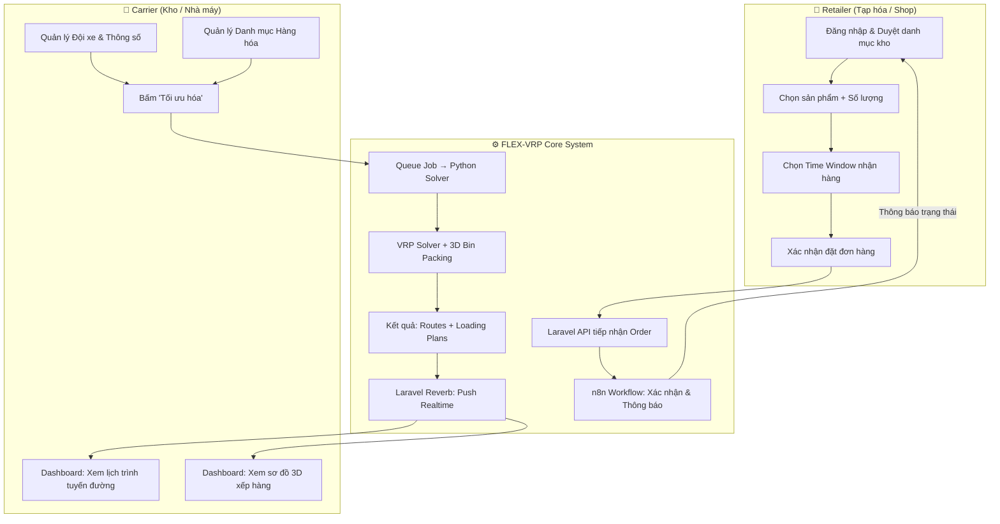
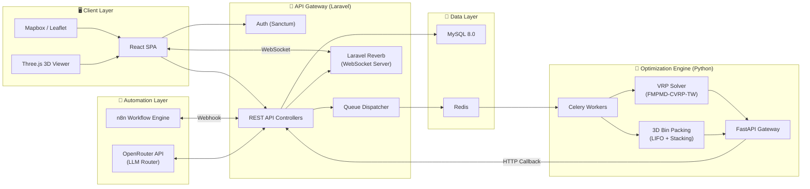
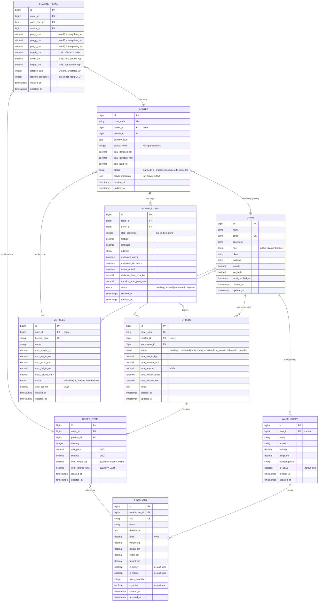
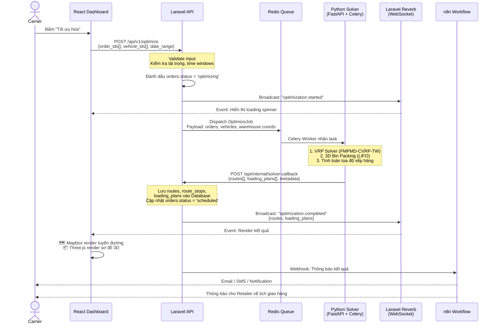
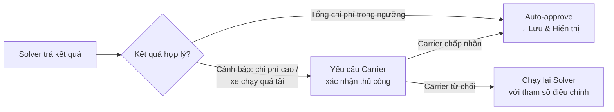
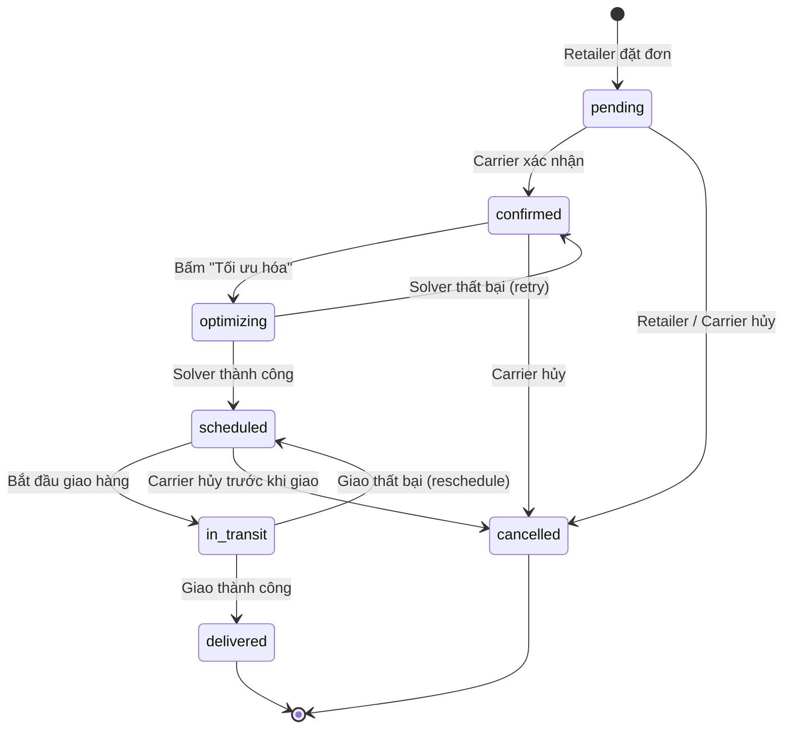

# FLEX-VRP — Architecture Document

> **Project:** SmartLog B2B — MVP  
> **Version:** 1.0.0  
> **Last Updated:** 2026-08-28  
> **Author:** FLEX-VRP Engineering Team

---

## Table of Contents

1. [System Overview & Business Architecture](#1-system-overview--business-architecture)
2. [Tech Stack & Component Diagram](#2-tech-stack--component-diagram)
3. [Database Schema (ERD & Migrations Specification)](#3-database-schema-erd--migrations-specification)
4. [Data Flow & Communication Protocol](#4-data-flow--communication-protocol)
5. [Security, Poka-yoke & Validation Rules](#5-security-poka-yoke--validation-rules)

---

## 1. System Overview & Business Architecture

### 1.1 Tổng quan Hệ thống

FLEX-VRP là nền tảng Web App B2B giải quyết bài toán **Tối ưu Định tuyến Giao hàng Đa kỳ (Multi-Period CVRP with Time Windows)** kết hợp **Tính toán Sơ đồ Bốc xếp 3D (3D Bin Packing)** cho chuỗi cung ứng vận tải B2B (kho nhà máy → tạp hóa / shop bán lẻ).

Hệ thống phục vụ hai nhóm người dùng chính:

| Vai trò | Mô tả | Hành động chính |
|---|---|---|
| **Retailer** (Người mua) | Tạp hóa, Shop thực phẩm, Mỹ phẩm | Duyệt danh mục kho → Đặt hàng → Chọn khung giờ nhận (Time Windows) |
| **Carrier** (Đơn vị vận chuyển) | Thủ kho, Quản lý vận tải | Quản lý xe & hàng → Kích hoạt thuật toán → Xem lịch trình + sơ đồ xếp hàng 3D |
| **Admin** | Quản trị hệ thống | Quản lý user, cấu hình hệ thống, giám sát hoạt động |

### 1.2 Luồng Nghiệp vụ Chính (Business Flow)



### 1.3 Hai Động cơ Thuật toán Cốt lõi

#### A. Tối ưu Định tuyến — FMPMD-CVRP-TW (Matheuristic)

- **Input:** Danh sách đơn hàng (địa chỉ, khối lượng, time windows), thông số đội xe (tải trọng, kích thước), ma trận khoảng cách/thời gian thực tế.
- **Process:** Thuật toán lai Matheuristic tự động:
  - Gom đơn (Consolidation) hoặc Chia nhỏ đơn (Split Delivery) nếu vượt tải.
  - Tính toán lộ trình đa kỳ (multi-period) né kẹt xe dựa trên dữ liệu giao thông thực tế.
  - Kết hợp dữ liệu thời tiết (OpenWeatherMap API) điều chỉnh hệ số thời gian.
- **Output:** Danh sách `routes` + `route_stops` tối ưu theo từng xe, từng ngày.

#### B. Tính toán Vị trí Xếp hàng — 3D Bin Packing

- **Input:** Kích thước thùng xe, danh sách hàng hóa (D × R × C, khối lượng, thuộc tính heavy/fragile).
- **Constraints:**
  - **LIFO (Last-In-First-Out):** Hàng giao trước phải nằm gần cửa thùng xe (xếp sau cùng).
  - **Stacking Rules:** Hàng nặng (`is_heavy = true`) xếp phía dưới; Hàng dễ vỡ (`is_fragile = true`) xếp phía trên.
  - **Stability:** Đảm bảo hàng hóa không bị lơ lửng (phải có mặt đỡ ≥ 70% diện tích đáy).
- **Output:** Tọa độ `(x, y, z)` vị trí đặt từng kiện hàng trong thùng xe → render 3D trên Dashboard.

---

## 2. Tech Stack & Component Diagram

### 2.1 Technology Stack

| Layer | Technology | Vai trò |
|---|---|---|
| **Frontend** | React 18+ | SPA Dashboard (Carrier & Retailer) |
| **Map Visualization** | Mapbox GL JS / Leaflet | Hiển thị tuyến đường tối ưu trên bản đồ |
| **3D Visualization** | Three.js / HTML5 Canvas | Render sơ đồ 3D thùng xe & vị trí hàng hóa |
| **Core API** | Laravel 11 (PHP 8.2+) | REST API, Business Logic, Queue Management |
| **Database** | MySQL 8.0+ | Lưu trữ dữ liệu chính |
| **ORM** | Eloquent ORM + Migrations | Schema management & Data access |
| **Realtime** | Laravel Reverb (WebSockets) | Push kết quả tính toán realtime lên Dashboard |
| **Workflow Automation** | n8n (Self-hosted) | Tự động hóa luồng đơn hàng & thông báo |
| **AI Agent / LLM** | OpenRouter API | Gọi Claude 3.5 / GPT-4o (tác vụ phức tạp), Gemini 1.5 Flash / Llama 3 (tra cứu nhanh) |
| **Optimization Engine** | Python 3.11+ (FastAPI + Celery) | Thực thi VRP Solver & 3D Bin Packing |
| **Task Queue** | Redis | Message broker cho Celery & Laravel Queue |
| **Containerization** | Docker + Docker Compose | Triển khai đồng nhất mọi môi trường |

### 2.2 Component Diagram



### 2.3 Deployment Architecture

```
┌─────────────────────────────────────────────────────────────────┐
│                    Docker Compose Stack                         │
│                                                                 │
│  ┌──────────┐  ┌──────────┐  ┌──────────┐  ┌──────────┐       │
│  │  Nginx   │  │ Laravel  │  │  Reverb  │  │   n8n    │       │
│  │ (Proxy)  │  │ App +    │  │ WebSocket│  │ Workflow │       │
│  │ :80/:443 │  │ Queue    │  │ :8080    │  │ :5678    │       │
│  └────┬─────┘  └────┬─────┘  └────┬─────┘  └────┬─────┘       │
│       │              │              │              │             │
│  ┌────┴──────────────┴──────────────┴──────────────┴─────┐      │
│  │                  Internal Network                      │      │
│  └────┬──────────────┬──────────────┬────────────────────┘      │
│       │              │              │                            │
│  ┌────┴─────┐  ┌─────┴────┐  ┌─────┴──────┐                    │
│  │  MySQL   │  │  Redis   │  │  Python    │                    │
│  │  :3306   │  │  :6379   │  │  FastAPI   │                    │
│  │          │  │          │  │  + Celery  │                    │
│  └──────────┘  └──────────┘  │  :8000     │                    │
│                              └────────────┘                    │
└─────────────────────────────────────────────────────────────────┘
```

---

## 3. Database Schema (ERD & Migrations Specification)

### 3.1 Entity Relationship Diagram (ERD)



### 3.2 Migrations Specification

#### `users` — Bảng người dùng

```php
Schema::create('users', function (Blueprint $table) {
    $table->id();
    $table->string('name');
    $table->string('email')->unique();
    $table->string('password');
    $table->enum('role', ['admin', 'carrier', 'retailer'])->default('retailer');
    $table->string('phone', 20)->nullable();
    $table->string('address')->nullable();
    $table->decimal('latitude', 10, 7)->nullable();
    $table->decimal('longitude', 10, 7)->nullable();
    $table->timestamp('email_verified_at')->nullable();
    $table->rememberToken();
    $table->timestamps();

    $table->index('role');
});
```

#### `warehouses` — Bảng kho hàng

```php
Schema::create('warehouses', function (Blueprint $table) {
    $table->id();
    $table->foreignId('user_id')->constrained('users')->cascadeOnDelete();
    $table->string('name');
    $table->string('address');
    $table->decimal('latitude', 10, 7);
    $table->decimal('longitude', 10, 7);
    $table->string('contact_phone', 20)->nullable();
    $table->boolean('is_active')->default(true);
    $table->timestamps();

    $table->index('user_id');
});
```

#### `products` — Bảng sản phẩm / hàng hóa

```php
Schema::create('products', function (Blueprint $table) {
    $table->id();
    $table->foreignId('warehouse_id')->constrained('warehouses')->cascadeOnDelete();
    $table->string('sku', 50)->unique();
    $table->string('name');
    $table->text('description')->nullable();
    $table->decimal('price', 15, 2)->default(0);            // VND
    $table->decimal('weight_kg', 10, 3);                     // Khối lượng
    $table->decimal('length_cm', 10, 2);                     // Dài
    $table->decimal('width_cm', 10, 2);                      // Rộng
    $table->decimal('height_cm', 10, 2);                     // Cao
    $table->boolean('is_heavy')->default(false);             // Hàng nặng
    $table->boolean('is_fragile')->default(false);           // Hàng dễ vỡ
    $table->unsignedInteger('stock_quantity')->default(0);
    $table->boolean('is_active')->default(true);
    $table->timestamps();

    $table->index('warehouse_id');
    $table->index(['is_active', 'stock_quantity']);
});
```

#### `vehicles` — Bảng xe tải / phương tiện

```php
Schema::create('vehicles', function (Blueprint $table) {
    $table->id();
    $table->foreignId('user_id')->constrained('users')->cascadeOnDelete();
    $table->string('license_plate', 20)->unique();
    $table->string('name');                                   // Tên / loại xe
    $table->decimal('max_weight_kg', 10, 2);                 // Tải trọng tối đa
    $table->decimal('max_length_cm', 10, 2);                 // Chiều dài lòng thùng
    $table->decimal('max_width_cm', 10, 2);                  // Chiều rộng lòng thùng
    $table->decimal('max_height_cm', 10, 2);                 // Chiều cao lòng thùng
    $table->decimal('max_volume_cm3', 15, 2)
          ->storedAs('max_length_cm * max_width_cm * max_height_cm');
    $table->enum('status', ['available', 'in_transit', 'maintenance'])->default('available');
    $table->decimal('cost_per_km', 10, 2)->default(0);       // Chi phí / km (VND)
    $table->timestamps();

    $table->index('user_id');
    $table->index('status');
});
```

#### `orders` — Bảng đơn hàng

```php
Schema::create('orders', function (Blueprint $table) {
    $table->id();
    $table->string('order_code', 30)->unique();
    $table->foreignId('retailer_id')->constrained('users')->cascadeOnDelete();
    $table->foreignId('warehouse_id')->constrained('warehouses')->cascadeOnDelete();
    $table->enum('status', [
        'pending', 'confirmed', 'optimizing',
        'scheduled', 'in_transit', 'delivered', 'cancelled'
    ])->default('pending');
    $table->decimal('total_weight_kg', 12, 3)->default(0);
    $table->decimal('total_volume_cm3', 15, 2)->default(0);
    $table->decimal('total_amount', 15, 2)->default(0);      // VND
    $table->dateTime('time_window_start');
    $table->dateTime('time_window_end');
    $table->text('notes')->nullable();
    $table->timestamps();

    $table->index('retailer_id');
    $table->index('warehouse_id');
    $table->index('status');
    $table->index(['time_window_start', 'time_window_end']);
});
```

#### `order_items` — Bảng chi tiết đơn hàng

```php
Schema::create('order_items', function (Blueprint $table) {
    $table->id();
    $table->foreignId('order_id')->constrained('orders')->cascadeOnDelete();
    $table->foreignId('product_id')->constrained('products')->restrictOnDelete();
    $table->unsignedInteger('quantity');
    $table->decimal('unit_price', 15, 2);
    $table->decimal('subtotal', 15, 2);
    $table->decimal('item_weight_kg', 12, 3);                // quantity × product.weight_kg
    $table->decimal('item_volume_cm3', 15, 2);               // quantity × L × W × H
    $table->timestamps();

    $table->index('order_id');
    $table->index('product_id');
});
```

#### `routes` — Bảng lịch trình giao hàng

```php
Schema::create('routes', function (Blueprint $table) {
    $table->id();
    $table->string('route_code', 30)->unique();
    $table->foreignId('carrier_id')->constrained('users')->cascadeOnDelete();
    $table->foreignId('vehicle_id')->constrained('vehicles')->cascadeOnDelete();
    $table->date('delivery_date');
    $table->unsignedTinyInteger('period_index')->default(1); // Chỉ số kỳ giao (multi-period)
    $table->decimal('total_distance_km', 10, 2)->default(0);
    $table->decimal('total_duration_min', 10, 2)->default(0);
    $table->decimal('total_load_kg', 10, 2)->default(0);
    $table->enum('status', ['planned', 'in_progress', 'completed', 'cancelled'])->default('planned');
    $table->json('solver_metadata')->nullable();              // Raw output từ Python Solver
    $table->timestamps();

    $table->index('carrier_id');
    $table->index('vehicle_id');
    $table->index('delivery_date');
    $table->index('status');
});
```

#### `route_stops` — Bảng điểm dừng giao hàng

```php
Schema::create('route_stops', function (Blueprint $table) {
    $table->id();
    $table->foreignId('route_id')->constrained('routes')->cascadeOnDelete();
    $table->foreignId('order_id')->constrained('orders')->cascadeOnDelete();
    $table->unsignedSmallInteger('stop_sequence');            // Thứ tự điểm dừng
    $table->decimal('latitude', 10, 7);
    $table->decimal('longitude', 10, 7);
    $table->string('address');
    $table->dateTime('estimated_arrival')->nullable();
    $table->dateTime('estimated_departure')->nullable();
    $table->dateTime('actual_arrival')->nullable();
    $table->decimal('distance_from_prev_km', 10, 2)->default(0);
    $table->decimal('duration_from_prev_min', 10, 2)->default(0);
    $table->enum('status', ['pending', 'arrived', 'completed', 'skipped'])->default('pending');
    $table->timestamps();

    $table->index('route_id');
    $table->index('order_id');
    $table->unique(['route_id', 'stop_sequence']);
});
```

#### `loading_plans` — Bảng tọa độ xếp hàng 3D

```php
Schema::create('loading_plans', function (Blueprint $table) {
    $table->id();
    $table->foreignId('route_id')->constrained('routes')->cascadeOnDelete();
    $table->foreignId('order_item_id')->constrained('order_items')->cascadeOnDelete();
    $table->foreignId('vehicle_id')->constrained('vehicles')->cascadeOnDelete();
    $table->decimal('pos_x_cm', 10, 2);                      // Tọa độ X
    $table->decimal('pos_y_cm', 10, 2);                      // Tọa độ Y
    $table->decimal('pos_z_cm', 10, 2);                      // Tọa độ Z
    $table->decimal('length_cm', 10, 2);                     // Chiều dài (có thể xoay)
    $table->decimal('width_cm', 10, 2);                      // Chiều rộng (có thể xoay)
    $table->decimal('height_cm', 10, 2);                     // Chiều cao
    $table->unsignedTinyInteger('rotation_axis')->default(0); // 0 = không xoay, 1 = xoay 90°
    $table->unsignedSmallInteger('loading_sequence');         // Thứ tự bốc hàng (LIFO)
    $table->timestamps();

    $table->index('route_id');
    $table->index('order_item_id');
    $table->index('vehicle_id');
});
```

---

## 4. Data Flow & Communication Protocol

### 4.1 Luồng Tối ưu hóa End-to-End

Khi Carrier bấm nút **"Tối ưu hóa"** trên Dashboard, luồng xử lý diễn ra như sau:



### 4.2 API Communication Contracts

#### Laravel → Python Solver (Request)

```json
{
  "task_id": "uuid-v4",
  "callback_url": "https://api.flex-vrp.com/api/internal/solver-callback",
  "warehouse": {
    "id": 1,
    "latitude": 10.7769,
    "longitude": 106.7009
  },
  "vehicles": [
    {
      "id": 1,
      "max_weight_kg": 2000,
      "max_length_cm": 400,
      "max_width_cm": 200,
      "max_height_cm": 200
    }
  ],
  "orders": [
    {
      "id": 101,
      "latitude": 10.7800,
      "longitude": 106.6950,
      "time_window_start": "2026-09-01T08:00:00",
      "time_window_end": "2026-09-01T12:00:00",
      "items": [
        {
          "order_item_id": 501,
          "product_id": 10,
          "quantity": 5,
          "weight_kg": 2.5,
          "length_cm": 30,
          "width_cm": 20,
          "height_cm": 15,
          "is_heavy": false,
          "is_fragile": true
        }
      ]
    }
  ],
  "config": {
    "use_traffic_matrix": true,
    "use_weather_adjustment": false,
    "max_periods": 3,
    "allow_split_delivery": true
  }
}
```

#### Python Solver → Laravel (Callback Response)

```json
{
  "task_id": "uuid-v4",
  "status": "success",
  "computation_time_ms": 12450,
  "routes": [
    {
      "vehicle_id": 1,
      "delivery_date": "2026-09-01",
      "period_index": 1,
      "total_distance_km": 25.7,
      "total_duration_min": 85,
      "total_load_kg": 450.5,
      "stops": [
        {
          "order_id": 101,
          "sequence": 1,
          "latitude": 10.7800,
          "longitude": 106.6950,
          "estimated_arrival": "2026-09-01T09:15:00",
          "estimated_departure": "2026-09-01T09:30:00",
          "distance_from_prev_km": 5.2,
          "duration_from_prev_min": 18
        }
      ]
    }
  ],
  "loading_plans": [
    {
      "vehicle_id": 1,
      "order_item_id": 501,
      "pos_x_cm": 0,
      "pos_y_cm": 0,
      "pos_z_cm": 0,
      "length_cm": 30,
      "width_cm": 20,
      "height_cm": 15,
      "rotation_axis": 0,
      "loading_sequence": 1
    }
  ],
  "solver_metadata": {
    "algorithm": "FMPMD-CVRP-TW-v2",
    "iterations": 5000,
    "objective_value": 125.7,
    "gap_percentage": 2.3
  }
}
```

### 4.3 WebSocket Events (Laravel Reverb)

| Channel | Event | Payload | Trigger |
|---|---|---|---|
| `private-carrier.{id}` | `optimization.started` | `{ task_id, order_count }` | Khi job được dispatch |
| `private-carrier.{id}` | `optimization.progress` | `{ task_id, percent, stage }` | Python gửi progress (optional) |
| `private-carrier.{id}` | `optimization.completed` | `{ task_id, routes[], loading_plans[] }` | Solver trả kết quả thành công |
| `private-carrier.{id}` | `optimization.failed` | `{ task_id, error_message }` | Solver gặp lỗi |
| `private-order.{id}` | `order.status.updated` | `{ order_id, status, message }` | Cập nhật trạng thái đơn hàng |

---

## 5. Security, Poka-yoke & Validation Rules

### 5.1 Authentication & Authorization

| Cơ chế | Mô tả |
|---|---|
| **Laravel Sanctum** | Token-based API authentication cho SPA & Mobile |
| **Role-based Access Control** | Middleware `role:carrier`, `role:retailer`, `role:admin` |
| **Route Protection** | Tất cả API routes nằm trong `auth:sanctum` middleware group |
| **CORS Policy** | Chỉ cho phép domain frontend đã đăng ký |
| **Rate Limiting** | 60 requests/phút cho API công khai; 10 requests/phút cho endpoint `/optimize` |

### 5.2 Poka-yoke — Chống Sai lệch Dữ liệu Đầu vào

> **Poka-yoke** (ポカヨケ) — Triết lý "chống sai sót" từ Toyota Production System, áp dụng vào validation dữ liệu để ngăn lỗi ngay từ đầu vào.

#### A. Validation tại API Layer (Laravel Form Request)

```php
// CreateOrderRequest.php
class CreateOrderRequest extends FormRequest
{
    public function rules(): array
    {
        return [
            'warehouse_id'      => 'required|exists:warehouses,id',
            'time_window_start' => 'required|date|after:now',
            'time_window_end'   => 'required|date|after:time_window_start',
            'items'             => 'required|array|min:1|max:50',
            'items.*.product_id'=> 'required|exists:products,id',
            'items.*.quantity'  => 'required|integer|min:1|max:9999',
        ];
    }
}
```

#### B. Business Logic Validation (Service Layer)

| Rule | Mô tả | Xử lý |
|---|---|---|
| **Time Window ≥ 2 giờ** | Khung giờ nhận phải tối thiểu 2 tiếng | Reject nếu `end - start < 2h` |
| **Stock Check** | Số lượng đặt ≤ số lượng tồn kho | Reject + trả về sản phẩm hết hàng |
| **Weight Feasibility** | Tổng khối lượng đơn ≤ max xe lớn nhất | Warning nếu cần Split Delivery |
| **Volume Feasibility** | Tổng thể tích đơn ≤ dung tích xe lớn nhất | Warning nếu cần Split Delivery |
| **Geocoding Check** | Tọa độ retailer phải hợp lệ (trong khu vực phục vụ) | Reject nếu ngoài vùng |
| **Duplicate Order Guard** | Không cho phép đặt đơn trùng trong cùng khung giờ | Reject + thông báo |

#### C. Solver Input Validation (Python Side)

```python
# validation.py — Poka-yoke trước khi chạy Solver
def validate_solver_input(payload: dict) -> list[str]:
    errors = []

    # Phải có ít nhất 1 đơn hàng
    if not payload.get("orders"):
        errors.append("EMPTY_ORDERS: Không có đơn hàng nào để tối ưu.")

    # Phải có ít nhất 1 xe khả dụng
    if not payload.get("vehicles"):
        errors.append("NO_VEHICLES: Không có xe nào khả dụng.")

    for order in payload.get("orders", []):
        # Tọa độ hợp lệ
        if not (-90 <= order["latitude"] <= 90):
            errors.append(f"INVALID_LAT: Order {order['id']} có latitude không hợp lệ.")
        if not (-180 <= order["longitude"] <= 180):
            errors.append(f"INVALID_LNG: Order {order['id']} có longitude không hợp lệ.")

        # Time window phải logic
        if order["time_window_start"] >= order["time_window_end"]:
            errors.append(f"INVALID_TW: Order {order['id']} có time window không hợp lệ.")

        for item in order.get("items", []):
            # Kích thước phải dương
            if any(v <= 0 for v in [item["weight_kg"], item["length_cm"],
                                     item["width_cm"], item["height_cm"]]):
                errors.append(f"INVALID_DIM: Item {item['order_item_id']} có kích thước ≤ 0.")

    return errors
```

### 5.3 HITL — Human-in-the-Loop

Hệ thống áp dụng cơ chế **Human-in-the-Loop** tại các điểm quyết định quan trọng:



| Trigger HITL | Điều kiện |
|---|---|
| Xe sử dụng ≥ 95% tải trọng | Yêu cầu Carrier xác nhận rủi ro quá tải |
| Split Delivery phát sinh | Thông báo để Carrier quyết định cho phép chia đơn |
| Khoảng cách tuyến đường > 100 km | Cảnh báo chi phí vận chuyển cao |
| Solver không tìm được lời giải khả thi | Đề xuất Carrier thêm xe hoặc điều chỉnh time window |

### 5.4 State Machine — Quản lý Trạng thái Đơn hàng



### 5.5 Data Integrity Rules

| Rule | Implementation |
|---|---|
| **Foreign Key Constraints** | Tất cả FK đều có `ON DELETE CASCADE` hoặc `RESTRICT` tùy nghiệp vụ |
| **Unique Constraints** | `email`, `sku`, `license_plate`, `order_code`, `route_code` |
| **Computed Columns** | `vehicles.max_volume_cm3` tự tính từ L × W × H |
| **Soft Validation** | `order_items.item_weight_kg` & `item_volume_cm3` được tính lại từ product master data khi lưu |
| **Idempotent Solver Callback** | Sử dụng `task_id` để tránh xử lý trùng kết quả solver |
| **Optimistic Locking** | Sử dụng `updated_at` timestamp để phát hiện concurrent update trên orders |

---

> **Document Status:** ✅ Living Document — Cập nhật theo từng Sprint.  
> **Next Review:** Sprint 2 Kickoff.
